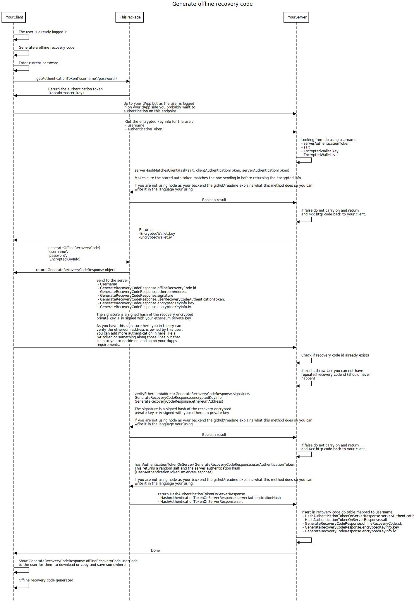
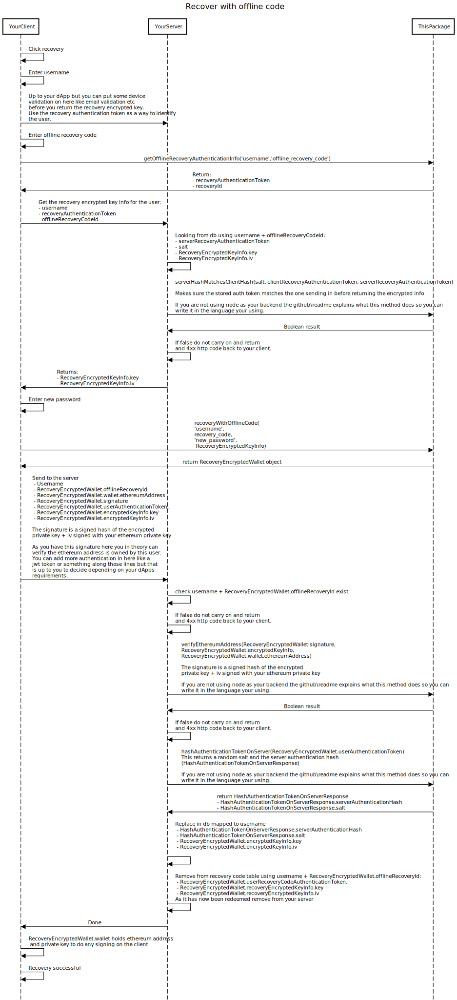

# TITLE_OF_PACKAGE!!

Encryption is scary and hard, knowing your doing the correct things with certain keys is hard to know. Also on top of this the mass amount of ethereum wallets sometimes add bad UX/UI and disjoint the user from your dApps, you may want to create a more integrated approach. On top of this, this package follows a web2 approach of a standard username and password making it simple for the user to use your application. Also creating something which is fully onchain is expensive currently due to transaction per each save state and encrypted keys themselives should be protected at least from people being able to just get a list and try to brute force it. This is a way you can do best of both worlds without you holding anyone's keys.

The aim of this package is to abstract all this :head_bandage: away for you and give you simple tools to allow you to create none custodial ethereum wallet logins, without worrying about how the encryption links together or the scary thought of saving peoples private keys.

All the decryption will happen on the client side and you will just need a server which stores the encrypted data and returns it. All of this data is useless without the keys generated client side.

Just to note using this kind of encryption is as safe as the username and password the user gives. The package does not force max contraints on the usage, it is up to you to decide how you want to force the user to make sure they enter a strong password and username. We strongly advise you force a strong password on creation of wallets to protect your user. We would not promote this approach for long term storing of crypto either, you can see this logic more as a hot/burner wallet aka your users can use this to interact with your dApp easily and safely. Supporting them without an extension just the native browser.

This model is based on the same model `LastPass` use for their none custodial password manager. It is also heavily influenced by how the none custodial `FunWallet` works.

## Install package

### NPM

```bash
$ npm install PACKAGE_NAME
```

### YARN

```bash
$ yarn PACKAGE_NAME
```

## Usage and flows

This will walk you through the usage of the package with flow diagrams explaining the flows.

### New wallet

Creating a new user.

#### Flow


Code example this includes client + server.

##### Client

```ts
import { createNewWallet } from 'ethereum-web2-encryption';

// They have just clicked the register button after entering
// their username and password
export const register = async (username: string, password: string) => {
  const encryptedWallet = await createWallet(username, password);
  console.log(encryptedWallet);
  // {
  //    wallet: {
  //        ethereumAddress: '0xa31e0D672AA9c6c4Ce863Bd17d1c7c9d6C56D5E8',
  //        privateKey: '0x602cbc76611ae50bcff99beacb4ab8e84853830f3036da946a8473107c4056e8',
  //    },
  //    signature: '0xf09eb344c7cbe4aebd7c3d2109eeddd5a3f1ec6a445a26ed1c46f47bce902a274af03b86f19557026055467a796a7e76be4c1fdd19132fd102097abe3124af081c',
  //    userAuthenticationToken: '0xace36d94ae1397b87135d363f207a440c5b30a0f2ce2ebf181b6ded0df9c84e7',
  //   encryptedKeyInfo: {
  //       key: '0xd0286e5b69d6003022a523e26bff0cdb1c2f28579ab692b10c0e68a7d3bb4b9a',
  //       iv: '0xa3b054976a6ffc7fa1c527577480b663',
  //    }
  //}

  const request = {
    username,
    ethereumAddress: encryptedWallet.ethereumAddress,
    signature: encryptedWallet.signature,
    userAuthenticationToken: encryptedWallet.userAuthenticationToken,
    encryptedKeyInfo: encryptedWallet.encryptedKeyInfo,
  };

  // look at server part below to see what your server is expected to do
  await fetch('YOUR_SERVER_API_REGISTER_ENDPOINT', {
    method: 'POST',
    headers: {
      'Content-Type': 'application/json',
    },
    body: JSON.stringify(request), // body data type must match "Content-Type" header
  });

  // done user is registered!
};
```

##### Server

```ts
import {
  verifyEthereumAddress,
  hashAuthenticationTokenOnServer,
} from 'ethereum-web2-encryption';
import db from 'YOUR_DB';

interface RegisterRequest {
  username: string;
  ethereumAddress: string;
  signature: string;
  userAuthenticationToken: string;
  encryptedKeyInfo: {
    key: string;
    iv: string;
  };
}

// They client has called the server endpoint which then calls this
// will keep in 1 method so its easy to follow
export const register = async (registerInfo: RegisterRequest) => {
  const userExists = await db.userExists(registerInfo.username);
  if (userExists) {
    throw new Error('Username already exists');
  }

  const ethereumAddressExists = await db.ethereumAddressExists(
    registerInfo.ethereumAddress
  );
  if (ethereumAddressExists) {
    throw new Error('Ethereum address already exists');
  }

  const ownsEthereumAddress = await verifyEthereumAddress(
    registerInfo.signature,
    registerInfo.encryptedKeyInfo,
    registerInfo.ethereumAddress
  );
  if (!ownsEthereumAddress) {
    throw new Error(
      'You do not own the ethereum address so can not register you'
    );
  }

  const serverAuthHashResult = await hashAuthenticationTokenOnServer(
    registerInfo.userAuthenticationToken
  );

  await db.createNewUser({
    username: registerInfo.username,
    ethereumAddress: registerInfo.ethereumAddress,
    serverAuthenticationHash: serverAuthHashResult.serverAuthenticationHash,
    salt: serverAuthHashResult.salt
    encryptedPk: registerInfo.encryptedKeyInfo.key,
    encryptedPkIv: registerInfo.encryptedKeyInfo.iv
  });

  // done user is registered!
};
```

### Login existing wallet

#### Flow


If the user wants to login to an already created wallet on your app you need to do the below:

#### Authentication token

Firstly you need to generate the authentication token (hash of the master_key):

```ts
import { getAuthenticationToken } from 'ethereum-web2-encryption';
...
const authenticationToken = await getAuthenticationToken(
  'THE_USERSNAME',
  'USERS_STRONG_PASSWORD'
);
console.log(authenticationToken);
// 0xace36d94ae1397b87135d363f207a440c5b30a0f2ce2ebf181b6ded0df9c84e7
```

You then need to expose an endpoint on your server which can pass in an authentication token and get back the encrypted key details, this contains the encrypted key and the iv used. This is the details you got when you created the users wallet. It is up to you how hard you make that information to get for a user, if that is a device validation or email validation you can add any added security to this model.

#### decrypt the wallet

Once you done the request to your server to return the encrypted private key and the iv you can call:

```ts
import { decryptWallet } from 'ethereum-web2-encryption';
...
const decryptedWallet = await decryptWallet(
  'THE_USERSNAME',
  'USERS_STRONG_PASSWORD',
  {
    key: '0xd0286e5b69d6003022a523e26bff0cdb1c2f28579ab692b10c0e68a7d3bb4b9a',
    iv: '0xa3b054976a6ffc7fa1c527577480b663',
  }
);
console.log(encryptedWallet);
// {
//    ethereumAddress: '0xa31e0D672AA9c6c4Ce863Bd17d1c7c9d6C56D5E8',
//    privateKey: '0x602cbc76611ae50bcff99beacb4ab8e84853830f3036da946a8473107c4056e8',
//}
```

That is all you need to do to login to an existing wallet, at this point you can sign transactions on the client and all without holding any keys on your server.

### Change password

#### Flow


If a user wants wants to change their password you need to call:

```ts
import { changePassword } from 'ethereum-web2-encryption';
...
const encryptedWallet = await changePassword(
  'THE_USERNAME',
  {
    oldPassword: 'USERS_OLD_STRONG_PASSWORD',
    newPassword: 'USERS_NEW_STRONG_PASSWORD',
  },
  {
    key: '0xd0286e5b69d6003022a523e26bff0cdb1c2f28579ab692b10c0e68a7d3bb4b9a',
    iv: '0xa3b054976a6ffc7fa1c527577480b663',
  }
);
console.log(encryptedWallet);
// {
//    wallet: {
//        ethereumAddress: '0xa31e0D672AA9c6c4Ce863Bd17d1c7c9d6C56D5E8',
//        privateKey: '0x602cbc76611ae50bcff99beacb4ab8e84853830f3036da946a8473107c4056e8',
//    },
//    userAuthenticationToken: '0xjhk77d82gj1397b87135d363f207a440c5b30a0f2ce2ebf181b6ded0df9c67v1',
//    encryptedKeyInfo: {
//       key: '0xh3457h9b69d6003022a523e26bff0cdb1c2f28579ab692b10c0e68a7d3kg3c7m',
//        iv: '0xn6j876576a6ffc7fa1c567573480j9876',
//    }
//}
```

#### Response

save the new `userAuthenticationToken` and `encryptedKeyInfo` to your server. Deleting the old `userAuthenticationToken` and `encryptedKeyInfo`.

```ts
export interface EncryptedWallet {
  // The wallet details this contains
  // the ethereum address and private key
  // you MUST not upload that private key anywhere
  // to be able to stay none custodial. That private key
  // is the ethereum wallet private key. As long as it stays
  // on your client then its all good!
  wallet: {
    ethereumAddress: string;
    privateKey: string;
  };
  // You must save all of the below to a server somewhere
  // this data is not senitive and if someone got it they
  // couldn't do much with it minus brute force the decryption.
  // If you lose this data then they will not be able to get back
  // to their private key so it must be stored safe

  // This is basically an authentication token to be able to
  // give the user back their encryptedPk key and iv. This is a hash
  // of the users master_key (the users username and password). We will
  // explain this usage a little later
  userAuthenticationToken: string;
  // This is the encrypted key which can be decrypted
  // with the master_key to get back to the ethereum private key
  encryptedKeyInfo: {
    key: string;
    iv: string;
  };
}
```

### Change username

You must do the checking yourself if the username already exists as you are managing this on your server. In this case if they are changing to a new username it can not conflict with another username on your server. Just as facebook/twitter/google/etc work.

#### Flow


If a user wants wants to change their username you need to call:

```ts
import { changeUsername } from 'ethereum-web2-encryption';
...
const encryptedWallet = await changeUsername(
  { oldUsername: 'THE_USERSNAME', newUsername: 'NEW_USERSNAME' },
  USERS_STRONG_PASSWORD,
  {
    key: '0xd0286e5b69d6003022a523e26bff0cdb1c2f28579ab692b10c0e68a7d3bb4b9a',
    iv: '0xa3b054976a6ffc7fa1c527577480b663',
  }
);
console.log(encryptedWallet);
// {
//    wallet: {
//        ethereumAddress: '0xa31e0D672AA9c6c4Ce863Bd17d1c7c9d6C56D5E8',
//        privateKey: '0x602cbc76611ae50bcff99beacb4ab8e84853830f3036da946a8473107c4056e8',
//    },
//    userAuthenticationToken: '0xjhk77d82gj1397b87135d363f207a440c5b30a0f2ce2ebf181b6ded0df9c67v1',
//   encryptedKeyInfo: {
//       key: '0xh3457h9b69d6003022a523e26bff0cdb1c2f28579ab692b10c0e68a7d3kg3c7m',
//        iv: '0xn6j876576a6ffc7fa1c567573480j9876',
//    }
//}
```

#### Response

save the new `userAuthenticationToken` and `encryptedKeyInfo` to your server. Deleting the old `userAuthenticationToken` and `encryptedKeyInfo`.

```ts
export interface EncryptedWallet {
  // The wallet details this contains
  // the ethereum address and private key
  // you MUST not upload that private key anywhere
  // to be able to stay none custodial. That private key
  // is the ethereum wallet private key. As long as it stays
  // on your client then its all good!
  wallet: {
    ethereumAddress: string;
    privateKey: string;
  };
  // You must save all of the below to a server somewhere
  // this data is not senitive and if someone got it they
  // couldn't do much with it minus brute force the decryption.
  // If you lose this data then they will not be able to get back
  // to their private key so it must be stored safe

  // This is basically an authentication token to be able to
  // give the user back their encryptedPk key and iv. This is a hash
  // of the users master_key (the users username and password). We will
  // explain this usage a little later
  userAuthenticationToken: string;
  // This is the encrypted private key which can be decrypted
  // with the master_key to get back to the ethereum private key
  encryptedKeyInfo: {
    key: string;
    iv: string;
  };
}
```

### Recovery

Ability to recover is critical on something which holds real funds. This exposes some easy to call methods to allow you to support this but still remain none custodial.

#### Generated offline recovery code

This lib supports ability to have offline recovery codes for your user.

##### Flow



```ts
import { generateOfflineRecoveryCode } from 'ethereum-web2-encryption';
...
const recoveryCodeResponse = await generateOfflineRecoveryCode(
  'THE_USERNAME',
  'USERS_STRONG_PASSWORD',
  {
    key: '0xd0286e5b69d6003022a523e26bff0cdb1c2f28579ab692b10c0e68a7d3bb4b9a',
    iv: '0xa3b054976a6ffc7fa1c527577480b663',
  }
);
console.log(recoveryCodeResponse);
// {
//    offlineRecoveryCode: '0xd09ec9d8b47d932cc66ef0496574dfee99aadc79d014f43b5ddd75980ddbd8512d0c1a33ab500dd34eff41490593696d7fe1a27e8ed1b2681270ee2aa6641bcc'
//    userRecoveryCodeAuthenticationToken: '0xjhk77d82gj1397b87135d363f207a440c5b30a0f2ce2ebf181b6ded0df9c67v1',
//   encryptedKeyInfo: {
//       key: '0xh3457h9b69d6003022a523e26bff0cdb1c2f28579ab692b10c0e68a7d3kg3c7m',
//        iv: '0xn6j876576a6ffc7fa1c567573480j9876',
//    }
//}
```

##### Response

save the recovery `userRecoveryCodeAuthenticationToken` and `encryptedKeyInfo` to your server.

```ts
export interface GenerateRecoveryCodeResponse {
  // This is the downloadable recovery code the user should download
  // or copy from once generated. The server must not store this value
  // anywhere
  offlineRecoveryCode: string;
  // You must save all of the below to a server somewhere
  // this data is not senitive and if someone got it they
  // couldn't do much with it minus brute force the decryption.
  // If you lose this data then they will not be able to get back
  // to their private key so it must be stored safe

  // This is basically an authentication token to be able to
  // give the user back their encryptedPk key and iv. This is a hash
  // of the users master_key (the users username and password). We will
  // explain this usage a little later
  userRecoveryCodeAuthenticationToken: string;
  // This is the encrypted key which can be decrypted
  // with the username + offline recovery code to get back to the ethereum private key
  // store this in a table mapped to `userRecoveryCodeAuthenticationToken`. This will
  // need to be queried if a user brings recovery > enter username and recovery code
  // explained move in the flow diagrams above
  encryptedKeyInfo: {
    key: string;
    iv: string;
  };
}
```

#### Recover using offline codes

If the user wants to recover remember you got their recovery encrypted data on the server.

##### Flow



##### Recovery authentication token

Firstly you need to generate the recovery authentication token (hash of the recovery_master_key):

```ts
import { getRecoveryAuthenticationToken } from 'ethereum-web2-encryption';
...
const recoveryAuthenticationToken = await getRecoveryAuthenticationToken(
  'THE_USERSNAME',
  'OFFLINE_RECOVERY_CODE'
);
console.log(recoveryAuthenticationToken);
// 0xace36d94ae1397b87135d363f207a440c5b30a0f2ce2ebf181b6ded0df9c84e7
```

you then as explained above - "ends the server the `userRecoveryCodeAuthenticationToken` which if matches that username you got mapped returns the `encryptedKeyInfo` for that token". At this point you got the `recoveryEncryptedKeyInfo`

```ts
import { recoverWithOfflineCode } from 'ethereum-web2-encryption';
...
const recoveryCodeResponse = await recoverWithOfflineCode(
  'THE_USERNAME',
  'RECOVERY_CODE',
  'USERS_NEW_STRONG_PASSWORD',
  {
    key: '0xd0286e5b69d6003022a523e26bff0cdb1c2f28579ab692b10c0e68a7d3bb4b9a',
    iv: '0xa3b054976a6ffc7fa1c527577480b663',
  }
);
console.log(recoveryCodeResponse);
// {
//    wallet: {
//        ethereumAddress: '0xa31e0D672AA9c6c4Ce863Bd17d1c7c9d6C56D5E8',
//        privateKey: '0x602cbc76611ae50bcff99beacb4ab8e84853830f3036da946a8473107c4056e8',
//    },
//    userAuthenticationToken: '0xjhk77d82gj1397b87135d363f207a440c5b30a0f2ce2ebf181b6ded0df9c67v1',
//    encryptedKeyInfo: {
//       key: '0xh3457h9b69d6003022a523e26bff0cdb1c2f28579ab692b10c0e68a7d3kg3c7m',
//        iv: '0xn6j876576a6ffc7fa1c567573480j9876',
//    }
//}
```

##### Response

save the new recovery `userAuthenticationToken` and `encryptedKeyInfo` to your server. Deleting the old `userAuthenticationToken` and `encryptedKeyInfo`. Also deleting any reference to the `userRecoveryCodeAuthenticationToken` and its `encryptedKeyInfo` from your server.

```ts
export interface EncryptedWallet {
  // The wallet details this contains
  // the ethereum address and private key
  // you MUST not upload that private key anywhere
  // to be able to stay none custodial. That private key
  // is the ethereum wallet private key. As long as it stays
  // on your client then its all good!
  wallet: {
    ethereumAddress: string;
    privateKey: string;
  };
  // You must save all of the below to a server somewhere
  // this data is not senitive and if someone got it they
  // couldn't do much with it minus brute force the decryption.
  // If you lose this data then they will not be able to get back
  // to their private key so it must be stored safe

  // This is basically an authentication token to be able to
  // give the user back their encryptedPk key and iv. This is a hash
  // of the users master_key (the users username and password). We will
  // explain this usage a little later
  userAuthenticationToken: string;
  // This is the encrypted key which can be decrypted
  // with the master_key to get back to the ethereum private key
  encryptedKeyInfo: {
    key: string;
    iv: string;
  };
}
```

## Explaining server node calls

If you are not using node for your backend then you can not use the exposed methods in the flow diagram. This will explain what the methods do so you can write them in your backend language of choice.

### hashAuthenticationTokenOnServer

This method hashes the client authentication token with a random salt to create you a server authentication token for that user. The built in method returns a `salt` and a `serverAuthenticationHash`

- salt = random generated 16 bytes
- serverAuthenticationHash = PBKDF(password: client_authentication_token, salt: randomBytes(16), iterations: 100000) then turned into a hex string

### serverHashMatchesClientHash

This method compares the passed in client authentication token to the server authentication hash to make sure the token is valid for that user. The build in method returns a boolean.

Parameters:

- userStoredSalt = The stored salt which was used to do the `hashAuthenticationTokenOnServer`
- clientAuthenticationToken = The client authentication that the client passed to the server
- serverAuthenticationHash = The server authentication hash that was generated by the `hashAuthenticationTokenOnServer`

algo = serverAuthenticationHash === PBKDF(password: client_authentication_token, salt: userStoredSalt, iterations: 100000)

### verifyEthereumAddress

This method uses the `ecdsaRecover` logic which most languages have ways to support this so I will not explain how it works.
